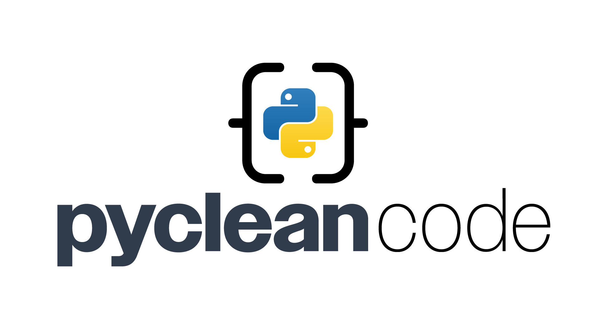

# Pycleancode: Professional Python Clean Code Toolkit

> **A Python toolkit to help developers write professional-grade, maintainable, and clean code following clean code principles.**

[](https://pypi.org/project/pycleancode/)
[](https://github.com/pycleancode/pycleancode/actions)
[]()
[](LICENSE)

---

**pycleancode** is a professional-grade Python toolkit that helps developers write clean, maintainable, and scalable code following clean code principles.

## 🌍 Project Goal

> Build multiple code quality tools under a single unified package architecture.

Unlike traditional linters that only focus on style violations, `pycleancode` implements advanced rule engines that target deeper structural and maintainability aspects of your code.

---

## 🔄 Why pycleancode?

While tools like `flake8`, `pylint`, `ruff`, and `black` are excellent, most focus heavily on surface-level syntax or style violations.

**pycleancode** is different:

* 🔄 Designed for professional teams writing critical Python codebases.
* 🤝 Rule-based pluggable architecture to extend new structural checks.
* 🔄 AST-powered deep nesting detection.
* 🎡 Focused on long-term maintainability.
* 🦖 OSS-grade code architecture.

---

## 🔄 Current Release - v1.0.4

**pycleancode 1.0.4** includes the first module: `brace_linter`, YAML threshold fixes, and security hardening for dependencies, CI, and console output.

### Brace Linter

The `brace_linter` module focuses on structural code depth and complexity. It analyzes Python code for excessive nesting and deeply nested functions that often make code harder to read, maintain, and extend.

### Key Features

* **Max Depth Rule**

  * Enforces maximum logical nesting depth.
  * Helps prevent pyramid-of-doom structures.

* **Nested Function Rule**

  * Enforces maximum levels of nested function definitions.
  * Prevents excessive local function scoping that can reduce readability.

* **Structural Reporting**

  * Full structural report of nesting tree.
  * Emoji + ASCII visualization of code structure.
  * Summary chart output for quick depth evaluation.

### Sample output:

```bash
sandbox/test_sample.py:2: Nested functions depth 2 exceeds allowed 1
sandbox/test_sample.py:3: Depth 4 exceeds max 3

📈 Structural Report:

 🔾 ROOT (Line 0, Depth 1)
│ 🔹 FunctionDef (Line 1, Depth 2)
│ │ 🔹 FunctionDef (Line 2, Depth 3)
│ │ │ 🔹 FunctionDef (Line 3, Depth 4)
```

---

## 🛡 Python Compatibility

- ✅ Supported Python versions: 3.9, 3.10, 3.11, 3.12
- ⚠ Python 3.13+ is not yet supported (due to upstream Rust dependencies)

## 🌐 Installation

Install via PyPI:

```bash
pip install pycleancode
```

Or using Poetry:

```bash
poetry add pycleancode
```

---

## 🔧 Basic Usage

Run directly via CLI:

```bash
pycleancode-brace-linter path/to/your/code.py --config pybrace.yml --report
```

---

## 🏓 Configuration

Configure via `pybrace.yml`:

```yaml
rules:
  max_depth:
    enabled: true
    max_depth: 3
  nested_function:
    enabled: true
    max_nested: 1
```

Pass config via CLI:

```bash
pycleancode-brace-linter your_code.py --config pybrace.yml
```

---

## 🔧 Development Setup

```bash
git clone git@github.com:YOUR_USERNAME/pycleancode.git
cd pycleancode
poetry install
pre-commit install
```

Run full tests:

```bash
poetry run pytest --cov=pycleancode --cov-report=term-missing
```

Run pre-commit:

```bash
poetry run pre-commit run --all-files
```

---

## 📖 Roadmap

| Module                  | Description                                    | Status      |
| ----------------------- | ---------------------------------------------- | ----------- |
| `brace_linter`          | Structural depth analysis (nesting, functions) | ✅ Completed |
| Full documentation site | OSS-grade docs & API reference                 | ⏳ Planned   |

---

## 🔒 License

Released under the MIT License. See [LICENSE](LICENSE).

---

## 🛡️ Code of Conduct

Please see our [CODE\_OF\_CONDUCT.md](CODE_OF_CONDUCT.md)

---

## 🔗 Contributing

We welcome OSS contributions. Please read our full [CONTRIBUTING.md](CONTRIBUTING.md) to get started!

* Clean Code Principles
* 100% Test Coverage Required
* Pre-commit Hooks Required
* Conventional Commits Required

---

## 🔔 Community

* GitHub Discussions (coming soon)
* Issues and PRs welcomed
* PyPI release v1.0.4 planned as a security-hardening release

---

🚀 **Pycleancode: Clean Code. Professional Quality. OSS-Grade Python. Unified Modular Clean Code Toolkit.**
